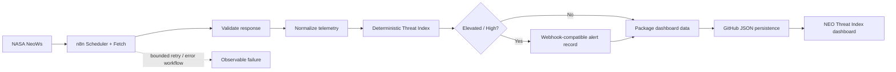

# NEO THREAT INDEX

An autonomous, periodically refreshed Near-Earth Object intelligence dashboard: n8n converts raw NASA NeoWs telemetry into transparent, actionable prototype risk assessments.

## Live demo

[neo-threat-index.vercel.app](https://neo-threat-index.vercel.app/)

## What it does

The dashboard presents the latest processed NEO feed in a mission-control interface with an interpretive Three.js flyby visualization. Each object has NASA-provided telemetry, a deterministic 0–100 threat index, provenance, freshness information, and a concise automated assessment.

This is a prototype prioritisation tool—not an official NASA planetary-defense system or an orbital-propagation engine.

## Why n8n?

n8n is the orchestration and intelligence layer. It schedules acquisition, retrieves NASA telemetry, rejects malformed records, normalizes a stable dashboard schema, invokes the deterministic threat engine, routes elevated events to an alert branch, and publishes an auditable JSON artifact for the frontend. A cron script could fetch data, but would not provide the same visual workflow, conditional branches, credential handling, retries, execution logs, or easy extension to notification providers.



## Threat scoring

**Prototype NEO Threat Index** is deterministic and explainable. It is not a NASA risk score.

| Feature | Points |
| --- | --- |
| NASA potentially-hazardous flag | +25 or 0 |
| Miss distance | +35 (≤1 LD), +28 (≤5), +18 (≤20), +8 (≤100), otherwise +2 |
| Estimated diameter | +25 (≥1000 m), +18 (≥300), +10 (≥100), otherwise +4 |
| Relative velocity | +15 (≥100,000 km/h), +10 (≥60,000), +6 (≥30,000), otherwise +2 |

The capped sum maps to LOW (0–24), MODERATE (25–49), ELEVATED (50–74), or HIGH (75–100). The dashboard shows the exact component values for a selected object.

## Data contract and provenance

`daily-asteroids.json` is the prototype persistence layer. Its top-level `metadata` records generated time, pipeline state, cadence, source, processor, and risk-model name. Each asteroid records its NASA source, n8n processor, original NASA/JPL reference when available, and derived risk fields. GitHub is intentionally used as an auditable zero-backend distribution layer for this hackathon build.

## Simulation mode

Choose **ARCHITECTURE → SIMULATE THREAT EVENT**. It creates a clearly labelled `source: "SIMULATION"` event with elevated parameters and exercises the same frontend scoring and alert-story path. It never writes to or disguises itself as the NASA dataset.

## Reliability and failure behavior

- HTTP retrieval has a 15-second timeout and three bounded attempts in n8n.
- Validation rejects malformed records; no valid records produces an observable workflow failure rather than corrupt JSON.
- The frontend times out feed retrieval, displays `ERROR`, and flags data as `STALE DATA` after 26 hours.
- The workflow currently uses a deterministic assessment fallback. If a credentialed LLM explanation node is added later, it must receive structured values only and must not determine risk; a failure must retain this fallback.
- The n8n export imports inactive by design. Configure credentials and explicitly activate it in the hosting n8n instance.

## Run locally

This is a static app. Serve the repository with any static server, for example:

```sh
npx serve .
```

Open the served `index.html`. It fetches the published GitHub feed; use a local server rather than `file://` so module imports behave correctly.

## Import the n8n workflow

1. Import `neo-pipeline.json` into n8n.
2. Create a NASA API credential/environment value named `NASA_API_KEY`; do not use a committed key.
3. Configure GitHub credentials in n8n for the persistence node.
4. Optionally connect the alert output to Slack, email, Discord, or a webhook with n8n-managed credentials.
5. Test with a manual execution, inspect rejected records, then activate the schedule.

## Security

No tokens, API keys, OAuth credentials, webhook secrets, or private endpoints belong in this repository. Use n8n Credentials and environment variables. The included NASA sample is public, static prototype data.

## Limitations and production path

- NASA’s hazardous flag and this heuristic do not constitute an impact prediction.
- The 3D visualization is an interpretive representation of relative flyby telemetry, not precise orbital propagation.
- The feed is periodically refreshed, not real-time.
- GitHub JSON is appropriate for a demo; production would retain n8n orchestration while using PostgreSQL/Supabase, an API/cache layer, monitoring, and access controls.

See [Judge Guide](docs/JUDGE_GUIDE.md) and [Demo Flow](docs/DEMO.md) for the hackathon presentation.
